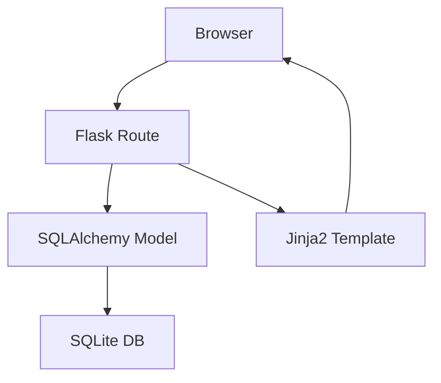

# ARCHITECTURE - 任務管理系統

## 1. 技術架構說明
- **後端**: Python + Flask – 提供輕量級的 Web 服務與 MVC 架構。
- **模板引擎**: Jinja2 – 負責 HTML 頁面渲染，與 Flask 緊密整合。
- **資料庫**: SQLite (透過 SQLAlchemy) – 輕量、無需額外伺服器，適合學生成果展示。
- **前端**: HTML、CSS、JavaScript – 靜態資源放於 `static/` 目錄，直接由 Flask 回傳。
- **部署**: 本地執行或簡易 Docker 容器，使用 HTTPS 保護傳輸。

## 2. 專案資料夾結構
```
project_root/
│   app.py                 # Flask 入口點
│   requirements.txt       # 依賴套件清單
│   README.md
│
├─app/                     # 核心應用程式
│   ├─models/              # SQLAlchemy 資料模型
│   │   └─task.py          # 任務模型
│   ├─routes/              # Flask 路由 (Controller)
│   │   ├─task.py          # 任務相關 API
│   │   └─auth.py         # 認證相關路由（未來可擴充）
│   ├─templates/          # Jinja2 HTML 模板 (View)
│   │   ├─layout.html
│   │   ├─task_list.html
│   │   └─task_detail.html
│   └─static/              # 前端靜態資源
│       ├─css/
│       │   └─styles.css
│       └─js/
│           └─main.js
│
├─instance/                # 用於儲存環境特定檔案，如 SQLite DB
│   └─database.db
└─tests/                   # 單元測試
    └─test_task.py
```

## 3. 元件關係圖 (Mermaid)


## 4. 關鍵設計決策
- **Flask MVC**: 採用 MVC 模式分離資料、業務與呈現，讓程式碼易於維護與擴充。
- **SQLite**: 因為目標使用者是學生，使用檔案式資料庫降低部署門檻，且對於中小規模任務管理已足夠。
- **模板渲染**: 使用 Jinja2 直接在伺服器端產生 HTML，避免前後端分離的複雜度，提升開發速度。
- **靜態資源管理**: 所有 CSS/JS 放於 `static/`，未來可導入 SCSS/TypeScript 以提升開發體驗。
- **測試導向**: 在 `tests/` 內加入單元測試，確保關鍵功能（任務 CRUD）在後續迭代中保持穩定。

---
*此文件為系統架構初版，後續可根據團隊需求進一步細化與擴充。*
