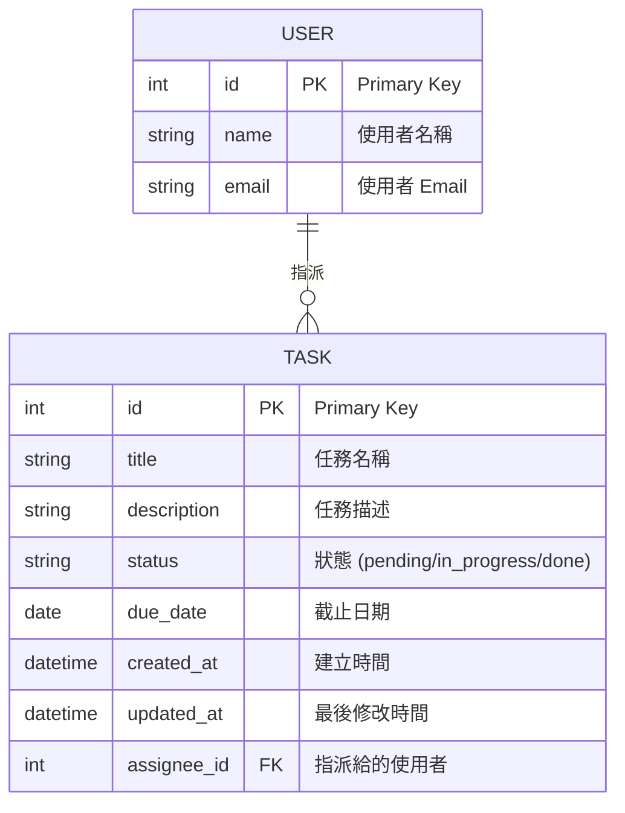

# DB Design - 任務管理系統

## ER Diagram (Mermaid)

## 資料表說明

### USER 表
- **id**: INTEGER PRIMARY KEY AUTOINCREMENT
- **name**: TEXT NOT NULL
- **email**: TEXT UNIQUE NOT NULL

### TASK 表
- **id**: INTEGER PRIMARY KEY AUTOINCREMENT
- **title**: TEXT NOT NULL
- **description**: TEXT
- **status**: TEXT CHECK(status IN ('pending','in_progress','done')) DEFAULT 'pending'
- **due_date**: DATE
- **created_at**: DATETIME DEFAULT CURRENT_TIMESTAMP
- **updated_at**: DATETIME DEFAULT CURRENT_TIMESTAMP
- **assignee_id**: INTEGER, FOREIGN KEY REFERENCES USER(id)

## 關聯說明
- 一位使用者（USER）可以指派多筆任務（TASK），形成一對多關係。TASK 透過 `assignee_id` 連結到指派的 USER。
