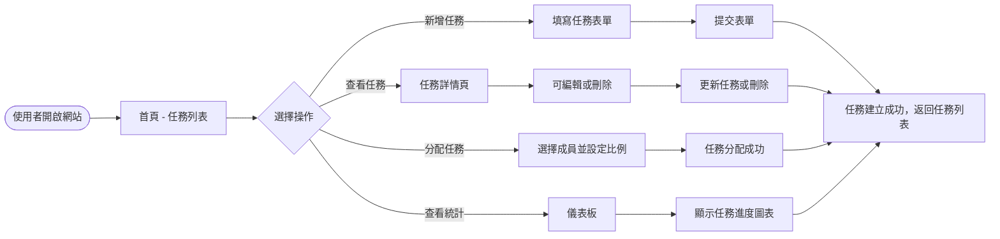
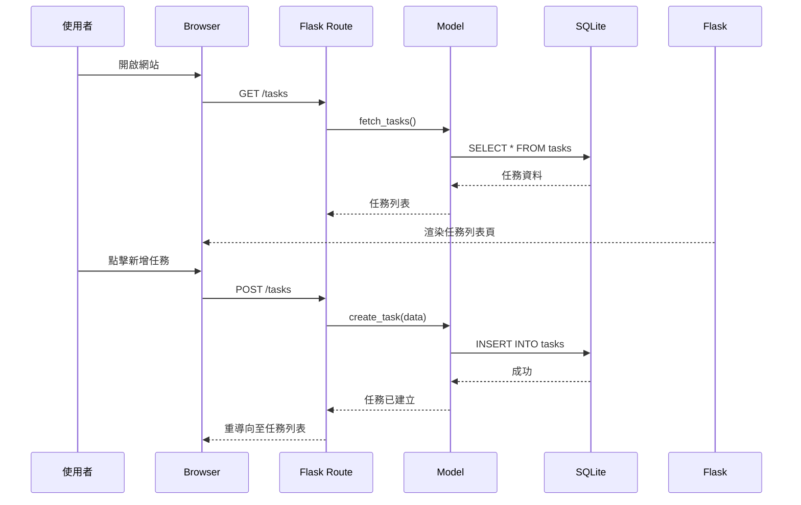

# Flowchart - 任務管理系統

## 使用者流程圖 (User Flow)

## 系統序列圖 (Sequence Diagram)

## 功能清單對照表
| 功能 | URL 路徑 | HTTP 方法 |
|------|----------|-----------|
| 任務建立 | /tasks | POST |
| 任務分配 | /tasks/:id/assign | POST |
| 進度追蹤 | /tasks/:id | GET/PUT |
| 提醒通知 | /tasks/:id/remind | POST |
| 紀錄與查詢 | /tasks | GET |
